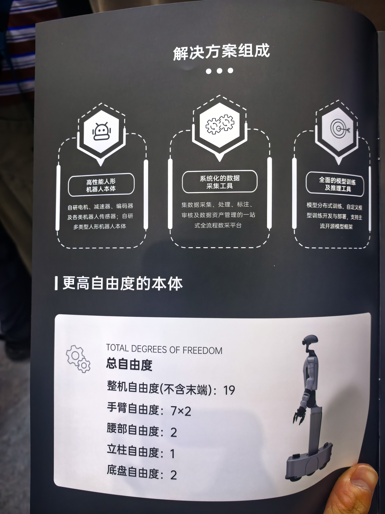
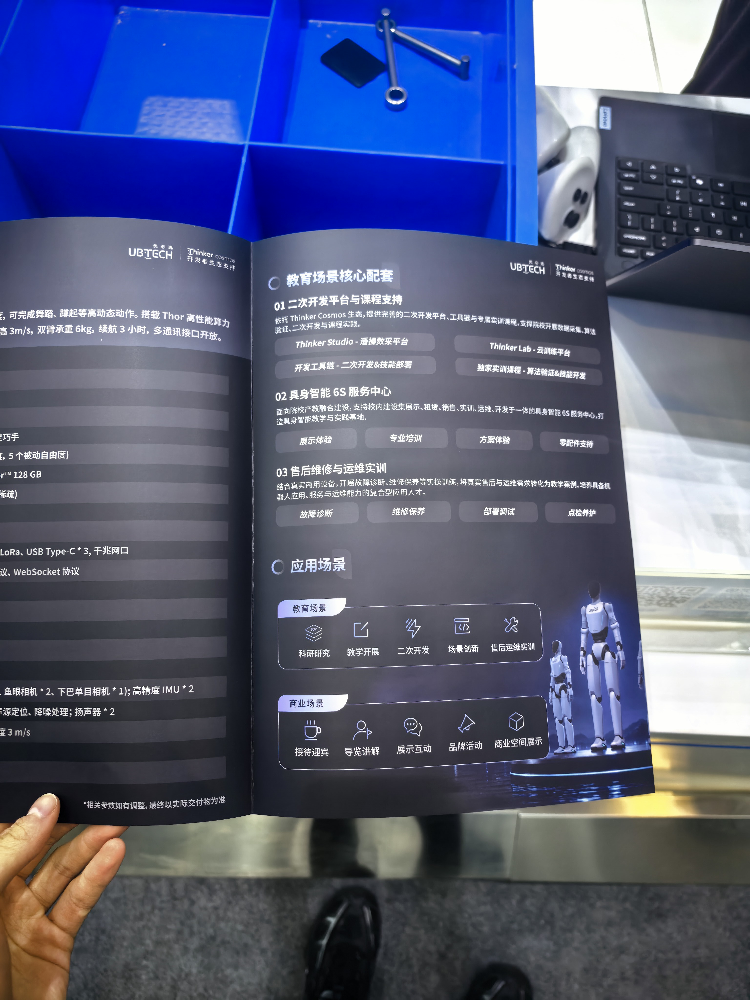
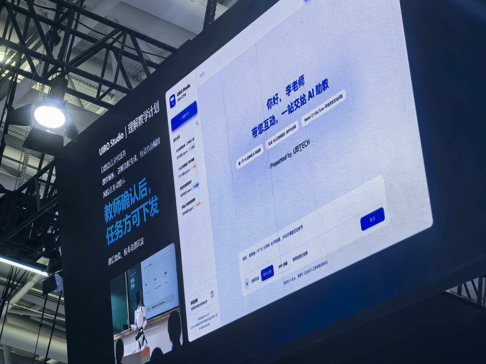
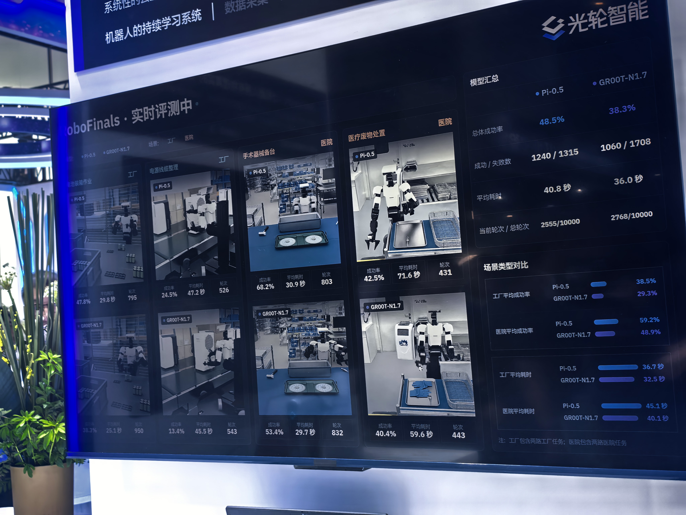

## 一点小思考
从现场来的游客来说，wrc的宣传还是非常成功的，有小朋友和家长，有学生，也有从业者，每天都是人山人海。

作为一个展览性质的活动，其实大多数观众是去凑热闹的，大家对机器人的认识还停留在趣味性。某种程度上也意味着没有惊艳普通人的demo,超越人类的生产速度还没有出现。

不过，本次wrc可以看到大多数公司的本体外形以及展示的demo任务同质化严重，说明设计和技术行业内都在收敛，短短一年发展已经非常迅速。

对于这次wrc,网上一个比较有意思的说法是

> 这次wrc发现，各家公司的本体不再是护城河，模型才是

我不这么认为，特别是在这样一个 coding agent 日渐成熟的时代，换模型架构其实并不困难。

另外，其实讨论模型架构在目前数据不充分、多模态研究发展不顺利以及很多过去研究都没有理解透彻的情况下，意义不是很大。

所以在我看来现在去 all in 模型不做本体的公司日后发展会受限，但可以作为大厂的子业务发展，比如lingbot

关于demo,大多数公司的demo，都是单一场景的，希望强调其模型的泛化性。其实听听就好，恰恰证明没有什么泛化性，因为都是针对单一场景疯狂采集的数据。

个人认为对于工业界这些公司，本体的 reliability 是更关键的，哪家公司能更快的在场景中把机器高强度用起来，对于其团队的发展是更好的。

## 以下是一些公司这次主要展示的内容
### 宇树：

- 机器人拳击
- 打乒乓球



- pick&place抗干扰



- 数采训练全栈解决方案

预计大量实验室会采购，因为可以预计的便宜

### 优必选：

- 仿生机器人
- 机器人教师二开平台

  

### lingbot：

主要是宣传开源的模型和方法，三个应用场景

- 帮助客户部署

  <video controls playsinline style="flex: 1 1 45%; max-width: 100%;" src="lingbot1.mp4"></video>
  <video controls playsinline style="flex: 1 1 45%; max-width: 100%;" src="lingbot2.mp4"></video>

- 和奥比中光合作的空间感知模型产品（模型应用）
- 整机解决方案（药店）

### 光轮智能：

全套仿真环境，训练流程和评测系统

### 星海图、自变量等

其他内容同质化比较严重，不过数据采集我觉得是普遍关注度比较高的地方，很多企业或学生比较关注UMI设备使用过程中的细节和跨本体的适配程度